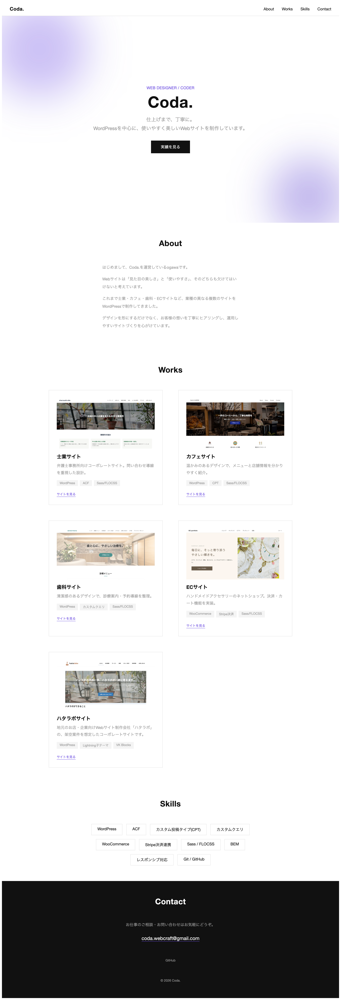
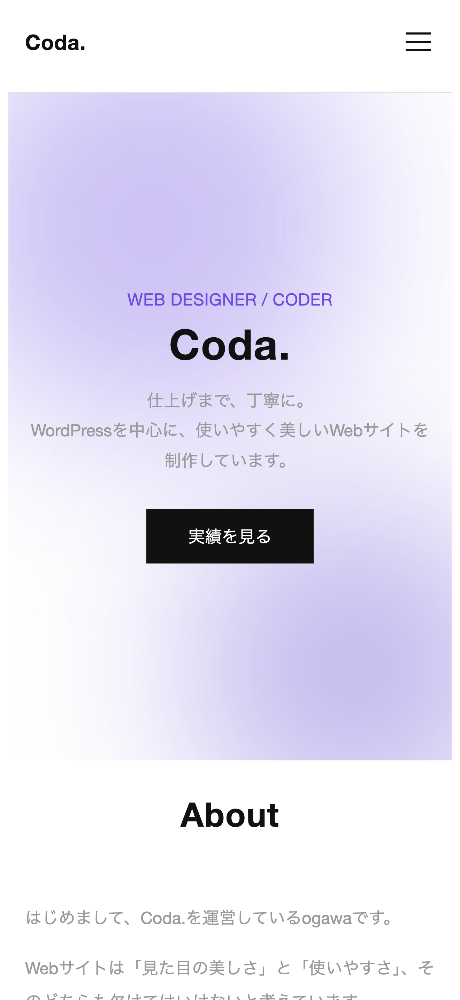

# coda. Portfolio Site

Web制作の案件獲得を目指して制作した、フリーランス(屋号：coda.)のポートフォリオサイト用WordPressオリジナルテーマです。

## サイト概要

- 1ページ完結のLP(ランディングページ)形式
- セクション構成:Hero / About / Works / Skills / Contact
- レスポンシブ対応、スマホ表示時はハンバーガーメニューでナビゲーションを表示

## サイトイメージ

<table>
  <tr>
    <td align="center"><strong>PC表示</strong></td>
    <td align="center"><strong>SP表示</strong></td>
  </tr>
  <tr>
    <td></td>
    <td></td>
  </tr>
</table>

## 使用技術

- WordPress(オリジナルテーマ)
- PHP
- Sass(FLOCSS設計 + BEM命名規則)
- JavaScript(バニラJS)

## 主な機能

- header.php / footer.php / front-page.php などを1から構築したオリジナルテーマ
- スマホ用ハンバーガーメニュー(クリックで開閉、アイコンが×に変化)
- Worksセクションから各制作実績の実演サイトへ遷移可能

## Works(掲載中の制作実績)

- 士業サイト
- カフェサイト
- 歯科サイト
- ECサイト(静的デモ)
- ハタラボサイト(架空案件)

## Demo

準備中

## 制作者

coda.(Web Designer / Coder)
